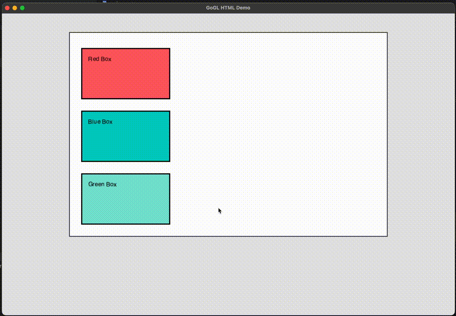

# goglweb

A from-scratch HTML/CSS rendering engine written in Go, targeting an OpenGL window (via GLFW). It implements the full browser rendering pipeline: parse HTML+CSS → build style tree → compute layout → generate display list → GPU rasterize using OpenGL 4.1. No browser engine embedded — all parsing, layout, and rendering is custom Go code.

[](https://golang.org)
[](LICENSE)
[](https://www.opengl.org/)

## Screenshot



## Features

- **HTML5 Parser**: Parses a subset of HTML5 including common elements (`div`, `p`, `h1-h6`, `span`, `img`, `br`, `hr`, etc.) with nesting depth protection
- **CSS Parser**: Supports CSS properties including:
  - Layout: `display` (block, inline, none, flex), `position`, `width`, `height`, `min-width`, `max-width`, `min-height`, `max-height`
  - Spacing: `margin`, `padding` (with shorthand and individual sides), margin collapsing between sibling blocks
  - Borders: `border` (with shorthand and individual sides)
  - Colors: `color`, `background-color` — hex (`#RGB`, `#RRGGBB`, `#RRGGBBAA`), `rgb()`, `rgba()`, named colors
  - Typography: `font-size`, `font-family`, `font-weight`, `font-style`, `text-align`
  - Visual: `opacity`, `cursor`
  - Units: `px`, `%`, `em`, `rem`, `vh`, `vw`, `vmin`, `vmax`
- **Flexbox Layout**: `display: flex`, `flex-direction`, `flex-wrap`, `justify-content`, `align-items`, `flex-grow`, `flex-shrink`, `flex-basis`
- **CSS Positioning**: `position: static/relative/absolute/fixed` with `top`, `left`, `bottom`, `right` offsets
- **Scrollable Containers**: `overflow: auto/scroll/hidden`, mouse wheel + keyboard scrolling with offset preservation across re-renders
- **OpenGL Rendering**: Renders UI using modern OpenGL (4.1+) with custom shaders, clipping via scissor test, and alpha blending
- **DOM Manipulation API**: `AppendChild`, `RemoveChild`, `SetAttribute`, `GetAttribute`, `RemoveAttribute`, `SetTextContent`, `GetTextContent`, `AddClass`, `RemoveClass`, `ToggleClass`
- **Event System**: Click, hover, keydown, keyup events with event bubbling through the DOM tree
- **Hit Testing**: Find elements at cursor position for interactive applications
- **Text Rendering**: Dynamic font atlas generation from system TTF/OTF/TTC fonts with word-wrap using real glyph metrics
- **Dirty-Flag Re-rendering**: Efficient partial updates via `MarkDirty()` — only rebuilds layout tree when the DOM changes
- **Zero Dependencies on Browser Engines**: No WebKit, Blink, or Servo – pure Go implementation
- **No JavaScript**: Pure static HTML+CSS rendering (no scripting support)
- **Minimal & Embeddable**: Designed to be integrated into games and tools without Electron/webview overhead

## Installation / Quick Start

```bash
git clone https://github.com/yourusername/gogl-html-parser.git
cd gogl-html-parser
go mod tidy
```

### Dependencies

- Go 1.25 or later
- OpenGL 4.1+ support
- GLFW 3.3+ (for window management)
- C compiler (for CGO dependencies)

On macOS:
```bash
brew install glfw
```

On Linux (Ubuntu/Debian):
```bash
sudo apt-get install libgl1-mesa-dev libglfw3-dev
```

On Windows:
- Install MinGW-w64 or use MSYS2
- Install GLFW from [glfw.org](https://www.glfw.org/download.html)

## Basic Usage

```go
package main

import (
    "goglweb/internal/dom"
    "goglweb/internal/gpu"
    "goglweb/internal/parser/css"
    "goglweb/internal/parser/html"

    "github.com/go-gl/gl/v4.1-core/gl"
    "github.com/go-gl/glfw/v3.3/glfw"
)

func main() {
    // Initialize GLFW and OpenGL (see cmd/demo/main.go for full setup)
    glfw.Init()
    defer glfw.Terminate()

    window, _ := glfw.CreateWindow(1200, 800, "My App", nil, nil)
    window.MakeContextCurrent()
    gl.Init()

    // Create GPU painter
    painter, _ := gpu.NewGPUPainter(
        1200, 800,
        "assets/shaders/vertex.glsl",
        "assets/shaders/fragment.glsl",
    )
    defer painter.Delete()

    // Parse HTML and CSS
    htmlSource := `
        <div class="container">
            <h1>Hello, World!</h1>
            <p>This is rendered with OpenGL</p>
        </div>
    `

    cssSource := `
        .container {
            display: block;
            width: 800px;
            margin: 50px auto;
            padding: 20px;
            background-color: white;
            border: 2px solid #333;
        }
        h1 {
            color: #4a90e2;
            font-size: 32px;
        }
    `

    htmlParser := html.NewParser(htmlSource)
    htmlRoot := htmlParser.Parse()

    cssParser := css.NewParser(cssSource)
    stylesheet := cssParser.Parse()

    // Create renderer
    renderer := dom.NewRenderer(htmlRoot, stylesheet, 1200, 800)

    // Main loop
    for !window.ShouldClose() {
        gl.Clear(gl.COLOR_BUFFER_BIT)
        displayList := renderer.GetDisplayList()
        displayList.Execute(painter)
        window.SwapBuffers()
        glfw.PollEvents()
    }
}
```

## Supported HTML/CSS Subset

### HTML Tags

| Tag | Status | Notes |
|-----|--------|-------|
| `div` | ✅ Supported | Block container |
| `p` | ✅ Supported | Paragraph (block) |
| `h1` - `h6` | ✅ Supported | Headings (block) |
| `span` | ✅ Supported | Inline container |
| `img` | ✅ Supported | Self-closing, requires `src` attribute |
| `br` | ✅ Supported | Line break |
| `hr` | ✅ Supported | Horizontal rule |
| `input` | ⚠️ Partial | Parsed but not fully rendered |
| `meta`, `link` | ⚠️ Partial | Parsed but ignored in layout |

### CSS Properties

| Property | Status | Notes |
|----------|--------|-------|
| `display` | ✅ Supported | `block`, `inline`, `none`, `flex` |
| `position` | ✅ Supported | `static`, `relative`, `absolute`, `fixed` |
| `top`, `left`, `bottom`, `right` | ✅ Supported | Offset for positioned elements |
| `overflow` | ✅ Supported | `visible`, `hidden`, `scroll`, `auto` |
| `width`, `height` | ✅ Supported | `px`, `%`, `em`, `rem`, `vh`, `vw`, `vmin`, `vmax`, `auto` |
| `margin` | ✅ Supported | Shorthand and individual sides; margin collapsing |
| `padding` | ✅ Supported | Shorthand and individual sides |
| `border` | ✅ Supported | Shorthand and individual sides (width, style, color) |
| `background-color` | ✅ Supported | Hex (`#RGB`, `#RRGGBB`, `#RRGGBBAA`), `rgb()`, `rgba()`, named colors |
| `color` | ✅ Supported | Text color |
| `font-size` | ✅ Supported | `px`, `em`, `rem` |
| `font-family` | ✅ Supported | Font name matching against system fonts |
| `font-weight` | ✅ Supported | `normal`, `bold` |
| `font-style` | ✅ Supported | `normal`, `italic` |
| `text-align` | ✅ Supported | `left`, `center`, `right` |
| `opacity` | ✅ Supported | 0.0 to 1.0 |
| `cursor` | ✅ Supported | Parsed but not yet applied to system cursor |
| `min-width`, `max-width` | ✅ Supported | Constraint properties |
| `min-height`, `max-height` | ✅ Supported | Constraint properties |
| `flex-direction` | ✅ Supported | `row`, `column`, `row-reverse`, `column-reverse` |
| `flex-wrap` | ✅ Supported | `nowrap`, `wrap`, `wrap-reverse` |
| `justify-content` | ✅ Supported | `flex-start`, `flex-end`, `center`, `space-between`, `space-around` |
| `align-items` | ✅ Supported | `stretch`, `flex-start`, `flex-end`, `center` |
| `flex-grow` | ✅ Supported | Grow factor |
| `flex-shrink` | ✅ Supported | Shrink factor |
| `flex-basis` | ✅ Supported | Base size along main axis |
| `grid` | ❌ Planned | Not yet implemented |
| `transform` | ❌ Planned | Not yet implemented |
| `animation` | ❌ Planned | Not yet implemented |

### CSS Selectors

- ✅ Element selectors (`div`, `p`, etc.)
- ✅ Class selectors (`.class-name`)
- ✅ ID selectors (`#id-name`)
- ✅ Universal selector (`*`)
- ✅ Descendant selectors (`div p`)
- ✅ Pseudo-classes (`:hover`) — basic support
- ❌ Attribute selectors — planned
- ❌ Pseudo-elements (`::before`, `::after`) — planned

## Roadmap / Planned Features

- [ ] **CSS Grid**: Grid layout system
- [ ] **CSS Transforms**: `transform` property support
- [ ] **CSS Transitions**: Basic animation support for property changes
- [ ] **More CSS Properties**: `box-shadow`, `border-radius`, `z-index`
- [ ] **Image Loading**: Load and render images from local files
- [ ] **More HTML Elements**: `button`, `input` (fully functional), `textarea`, `select`
- [ ] **Media Queries**: Responsive design support
- [ ] **CSS Variables**: Custom properties support
- [ ] **@import**: CSS import statements

## Limitations

- **No JavaScript**: This is intentional – the project focuses on static HTML+CSS rendering only.
- **No Network Requests**: Cannot load external resources (images, fonts) from URLs. All assets must be local.
- **No CSS Preprocessing**: No support for CSS variables, `@import`, or `@media` queries yet.
- **No CSS Grid**: Grid layout is not implemented. Use flexbox for complex layouts.
- **Performance**: No optimization for large DOM trees. Suitable for UI panels and simple pages but may struggle with very complex layouts.

## Building & Running

### Prerequisites

1. **Go 1.25+**: [Download Go](https://golang.org/dl/)
2. **OpenGL 4.1+**: Usually provided by your graphics drivers
3. **GLFW 3.3+**: Window and input management
4. **C Compiler**: Required for CGO (used by Go GL bindings)

### Build

```bash
go build -o demo ./cmd/demo
```

### Run

```bash
./demo
```

Or directly with `go run`:

```bash
go run ./cmd/demo/main.go
```

### Project Structure

```
goglweb/
├── cmd/
│   └── demo/               # Main application entry point
├── internal/
│   ├── parser/
│   │   ├── html/           # HTML tokenizer and parser
│   │   └── css/            # CSS tokenizer and parser
│   ├── style/              # Style computation, cascade, and inheritance
│   ├── layout/             # Layout engine (block, inline, flex, positioned, scroll)
│   ├── render/             # Display list generation
│   ├── gpu/                # OpenGL rendering (shaders, textures, fonts)
│   └── dom/                # DOM manipulation, events, hit testing, renderer
└── assets/
    └── shaders/            # GLSL vertex and fragment shaders
```

## License

MIT License. See [LICENSE](LICENSE) file for details.

## Contributing

Contributions are welcome!

1. Fork the repository
2. Create a feature branch (`git checkout -b feature/amazing-feature`)
3. Commit your changes (`git commit -m 'Add some amazing feature'`)
4. Push to the branch (`git push origin feature/amazing-feature`)
5. Open a Pull Request

### Areas That Need Help

- CSS Grid implementation
- CSS transforms and animations
- Image loading and rendering
- Performance optimizations
- Documentation and examples
- Test coverage

## Author / Contact

Created for in-game/user interfaces in custom OpenGL applications.

For questions, issues, or contributions, please open an issue on GitHub.
